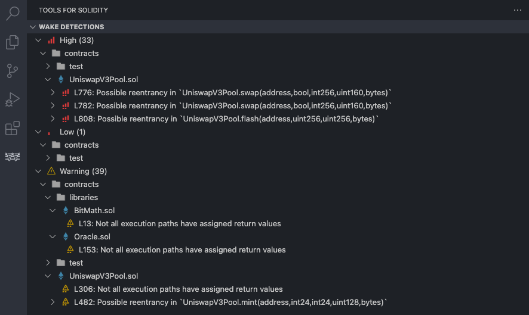

# [Ackee Blockchain](https://ackee.xyz) Tools for Solidity ([Wake](https://getwake.io))

Tools for Solidity is an extension for Visual Studio Code, powered by [Wake](https://getwake.io), that offers most of the language server features and displays real-time results of vulnerability detectors and compiler in custom UI. Different graph types can be generated to better visualize the relations in the code.

**Features:**

- Diagnostics & Detections UI
- Go to Definition, Type Definition, Implementation
- Find References
- Type Hierarchy
- Document Links, Document Symbols
- Hover
- Code Lens
- Rename

**Supported graph types:**

- Control Flow Graph
- Inheritance Graph
- Linearized Inheritance Graph

## Dependencies

The Tools for Solidity extension uses the PyPi package [eth-wake](https://pypi.org/project/eth-wake/) which requires Python 3.8 or higher. Python 3.12 is experimentally supported.

Rosetta is required to be enabled on Apple Silicon (M1, M2 & M3) Macs.

To display the generated graphs, Graphviz (DOT) extension must be installed e.g. [Graphviz Preview](https://marketplace.visualstudio.com/items?itemName=EFanZh.graphviz-preview).

## Installation

The package [eth-wake](https://pypi.org/project/eth-wake/) is installed `automatically` when this extension is activated.

Alternatively, it can be installed `manually` using:

```shell
python3 -m pip install eth-wake
```

## Features

### Detections

Vulnerability detections from [Wake](https://getwake.io) are shown in our Detections UI with customizable grouping by path, impact, confidence or detector, and filtering by impact and confidence.



### Go to definition


### Go to implementation

Find implementations of an unimplemented function or modifier.


### Find references


### Code lens

Number of references is shown above each declaration.


### Type hierarchy

Also works for virtual functions.


### Document links


### Document symbols


### Hover

Includes links to documentation for OpenZeppelin contracts.


### Control flow graphs


### Inheritance graphs


### Diagnostics


Together with compiler errors, diagnostics also include results from [Wake](https://getwake.io) vulnerability detectors.

Detections and compiler warnings may be ignored by adding a comment in one of the following formats:

- `// wake-disable-line` disables diagnostics for the current line,
- `// wake-disable-next-line` disables diagnostics for the next line,
- `// wake-disable` disables diagnostics for the current line and all following lines until `// wake-enable` is encountered,
- `// wake-enable` re-enables diagnostics after `// wake-disable`.

All comment types may be followed by a list of detector names and compiler warning codes separated by commas.
Whitespace is ignored. For example:

```solidity
// wake-disable-line reentrancy, 1349
```

Compiler errors cannot be ignored. If no detectors or warning codes are specified, all diagnostics are ignored (or re-enabled in case of `// wake-enable`).

## Supported commands

- **Tools for Solidity: Force Recompile Project**

```shell
Tools-for-Solidity.detections.force_recompile
```
Force recompile the opened project/files.

- **Tools for Solidity: Force Rerun Detectors**

```shell
Tools-for-Solidity.detections.force_rerun_detectors
```

Force rerun Wake vulnerability and issue detectors on the opened project/files.

- **Tools for Solidity: Generate Inheritance Graph**

```shell
Tools-for-Solidity.generate.inheritance_graph
```
Generate an inheritance graph for the whole project.

- **Tools for Solidity: Generate Imports Graph**

```shell
Tools-for-Solidity.generate.imports_graph
```
Generate an imports graph for the whole project.

- **Tools for Solidity: Import Foundry Remappings**

```shell
Tools-for-Solidity.foundry.import_remappings
```
Automatically configure the compiler remappings in a Foundry project.

## Known Issues

- **Files created/modified/deleted outside of VS Code are not properly analyzed**

The extension currently does not handle changes external to VS Code. This especially means that files installed into `node_modules` are not detected. Please run the `Wake: Force Recompile Project` command after installing node packages as a workaround.

- **`Go to references`, number of references and other features do not work correctly with no workspace open**

It is always recommended to open a project as a folder (`File -> Open folder`). `Open file` should only be used when opening a single file or several files inside the same folder.

- **Analysis does not work when the workspace contains compilation errors**

The extension relies on the `solc` compiler. For this reason, files containing compilation errors and files importing these files cannot be analysed.

## Acknowledgements

We used [juanfranblanco/vscode-solidity](https://github.com/juanfranblanco/vscode-solidity/blob/master/syntaxes/solidity.json) as a base of our Solidity grammar.
