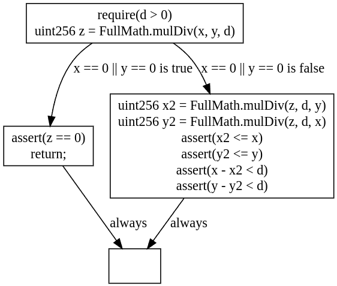
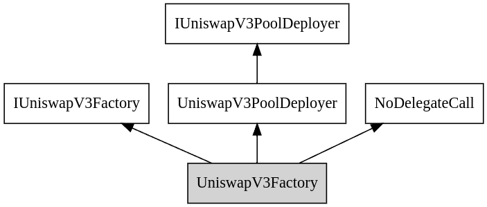
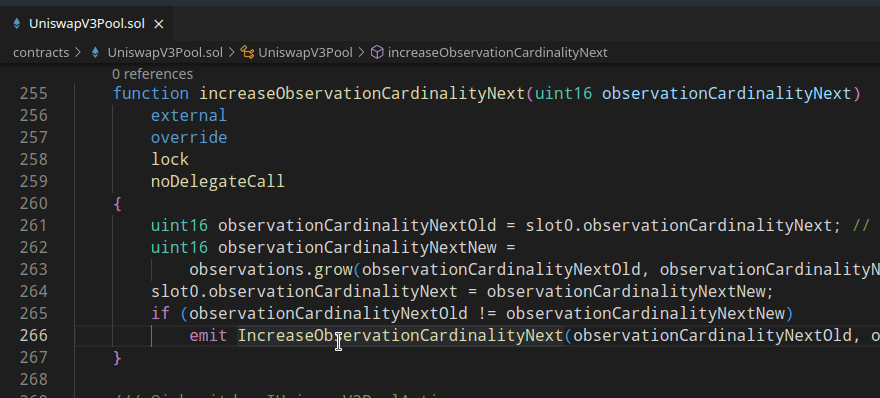
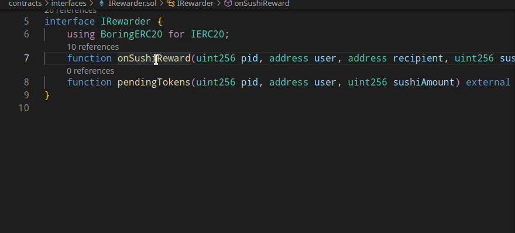
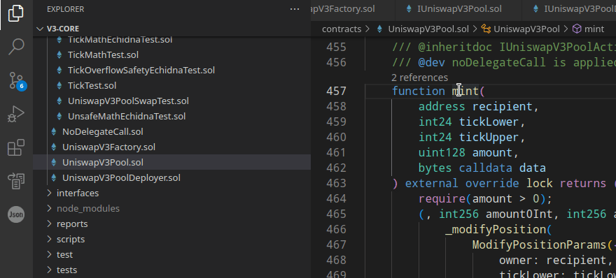
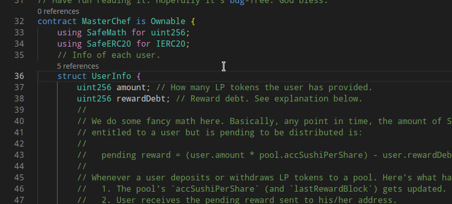
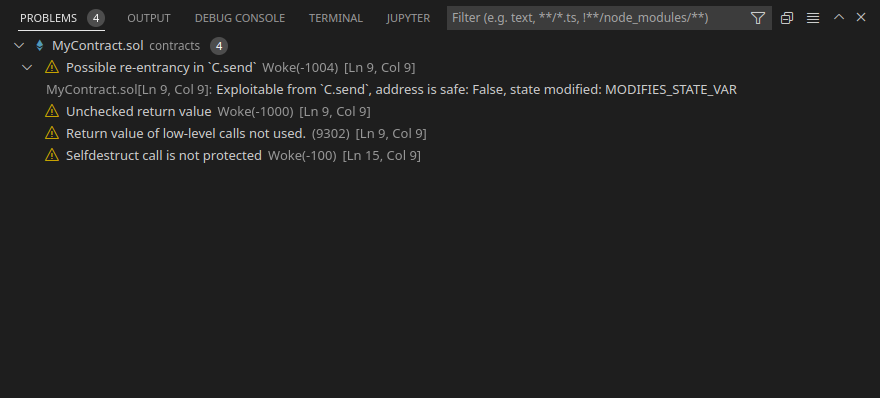

# [Ackee Blockchain](https://ackeeblockchain.com) Tools for Solidity

Tools for Solidity is an extension for Visual Studio Code that implements a language server for Solidity. It offers most of the language server features and displays results of vulnerability detectors along with compiler warnings and errors. Different graph types can be generated to better vizualize the relations in the code.

**This extension provides the following language server features:**

- Go to definition
- Go to type definition
- Go to implementation
- Find references
- Type hierarchy
- Document links
- Hover
- Code lens
- Document symbols
- Diagnostics
- Rename

**The following types of graphs can be generated:**

- Control flow graph of a function
- Inheritance graph of a contract
- Inheritance graph of a whole project
- Linearized inheritance graph of a contract

## Dependencies

The Tools for Solidity extension uses the PyPi package [eth-wake](https://pypi.org/project/eth-wake/) which requires Python 3.7 or higher. Python 3.12 is experimentally supported.

Rosetta is required to be enabled on Apple Silicon (M1 & M2) Macs.

To display the generated graphs, one of the supported Graphviz (DOT) extensions must be installed:

- [Graphviz (dot) language support for Visual Studio Code](https://marketplace.visualstudio.com/items?itemName=joaompinto.vscode-graphviz) (recommended)
- [Graphviz Preview](https://marketplace.visualstudio.com/items?itemName=EFanZh.graphviz-preview)
- [Graphviz Interactive Preview](https://marketplace.visualstudio.com/items?itemName=tintinweb.graphviz-interactive-preview)

## Installation

The package [eth-wake](https://pypi.org/project/eth-wake/) is installed `automatically` when this extension is activated.

Alternatively, it can be installed `manually` using:

```shell
python3 -m pip install eth-wake
```

## Features

### Control flow graphs



### Inheritance graphs



### Go to definition



### Go to type definition


### Go to implementation

Find implementations of an unimplemented function or modifier.



### Find references


### Type hierarchy


Also works for virtual functions.



### Document links


### Hover

Includes links to documentation for OpenZeppelin contracts.



### Code lens

Number of references is shown above each declaration.


### Document symbols


### Diagnostics


Together with compiler errors, diagnostics also include results from Wake vulnerability detectors.




### Rename


## Supported commands

- **Tools for Solidity: Force Recompile Project**

```shell
wake.lsp.force_recompile
```
Force recompile the opened project/files.

- **Tools for Solidity: Force Rerun Detectors**

```shell
wake.lsp.force_rerun_detectors
```

Force rerun Wake vulnerability and issue detectors on the opened project/files.

- **Tools for Solidity: Generate Inheritance Graph**

```shell
Tools-for-Solidity.generate.inheritance_graph
```
Generate an inheritance graph for the whole project.

- **Tools for Solidity: Generate Imports Graph**

```shell
Tools-for-Solidity.generate.imports_graph
```
Generate an imports graph for the whole project.

## Known Issues

- **Files created/modified/deleted outside of VS Code are not properly analysed**

The extension currently does not handle changes external to VS Code. This especially means that files installed into `node_modules` are not detected. Please run the `Wake: Force Recompile Project` command after installing node packages as a workaround.

- **`Go to references`, number of references and other features do not work correctly with no workspace open**

It is always recommended to open a project as a folder (`File -> Open folder`). `Open file` should only be used when opening a single file or several files inside the same folder.

- **Analysis does not work when the workspace contains compilation errors**

The extension relies on the `solc` compiler. For this reason, files containing compilation errors and files importing these files cannot be analysed.

## Acknowledgements

We used [juanfranblanco/vscode-solidity](https://github.com/juanfranblanco/vscode-solidity/blob/master/syntaxes/solidity.json) as a base of our Solidity grammar.
