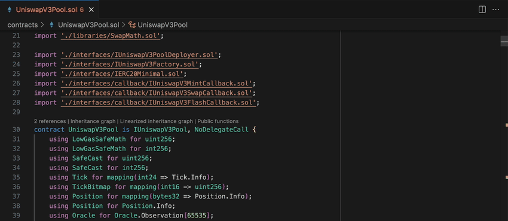
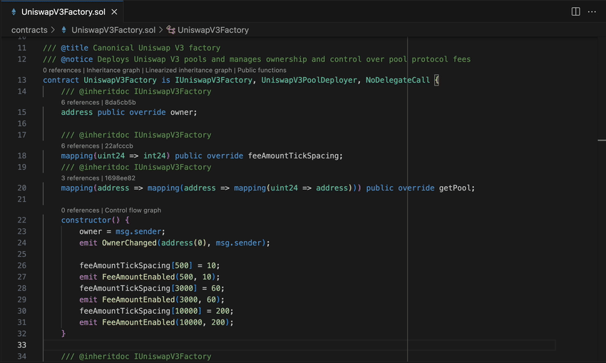

# Solidity by [Ackee Blockchain Security](https://ackee.xyz)

<picture>
  <source
    media="(prefers-color-scheme: dark)"
    srcset="https://img.shields.io/discord/867746290678104064?colorA=21262d&colorB=0000FF&style=flat">
  
</picture>

<picture>
  <source
    media="(prefers-color-scheme: dark)"
    srcset="https://img.shields.io/visual-studio-marketplace/d/AckeeBlockchain.tools-for-solidity?colorA=21262d&colorB=0000FF&style=flat">
  
</picture>  

Ethereum Solidity and local node testing with security features for Visual Studio Code.

This extension adds language support for Solidity to Visual Studio Code, and provides a remix-like experience for testing contracts on your local network. Benefits:
- Test and interact with your smart contracts on an Ethereum local node
- See vulnerabilities from static analysis in real-time
- Best code navigation experience, call-graphs and more.

## Test and interact with your smart contracts on an Ethereum local node

### Compile and deploy contracts

Compile your contracts and deploy them on a local chain for testing

### Interact with contracts

Test your deployed contracts by interacting with them using function calls with different inputs

## See vulnerabilities from static analysis in real-time

### Compilation Errors

See compilation errors highlighted in code

### See vulnerabilities from static analysis in real-time

Catch potential issues early with real-time static analysis

### Security Overview in the Sidebar

Get an overall overview of issues in your project

## Best code navigation experience, call-graphs and more

### Go to definition

Quickly navigate to any function or variable definition with a click

### Find references

Right click to see a context menu, and use it to find all references

### Document Links

Click and jump to linked files and resources

### Hover

Use hover to see instant documentation in your code

### See Contract Outline

Navigate big projects with ease using the Contract Outline

### Code Lens

Code Lens shows you relevant information like functions selectors and parameter references inside your code

### Graphs

Visualise contract inheritance and function control flows with graphs

## Requirements

The Solidity extension uses the PyPi package [eth-wake](https://pypi.org/project/eth-wake/) which requires Python 3.8 or higher. Python 3.12 is experimentally supported. This package is automatically installed via conda by default. See [link](https://ackee.xyz/solidity/docs/installation) for other installation optional.

Rosetta is required to be enabled on Apple Silicon (M1, M2 & M3) Macs.

## Credits
[juanfranblanco/vscode-solidity](https://github.com/juanfranblanco/vscode-solidity/blob/master/syntaxes/solidity.json): a base of our Solidity grammar

[joaompinto/vscode-graphviz](https://github.com/joaompinto/vscode-graphviz): a base of our Graphviz integration

## Feedback, help and news
Get help and give feedback in our [Discord](https://discord.gg/x7qXXnGCsa)

Follow Ackee on [Twitter](https://twitter.com/AckeeBlockchain)

## Known Issues

- **Files created/modified/deleted outside of VS Code are not properly analyzed**

The extension currently does not handle changes external to VS Code. This especially means that files installed into `node_modules` are not detected. Please run the `Wake: Force Recompile Project` command after installing node packages as a workaround.

- **`Go to references`, number of references and other features do not work correctly with no workspace open**

It is always recommended to open a project as a folder (`File -> Open folder`). `Open file` should only be used when opening a single file or several files inside the same folder.

- **Analysis does not work when the workspace contains compilation errors**

The extension relies on the `solc` compiler. For this reason, files containing compilation errors and files importing these files cannot be analysed.
