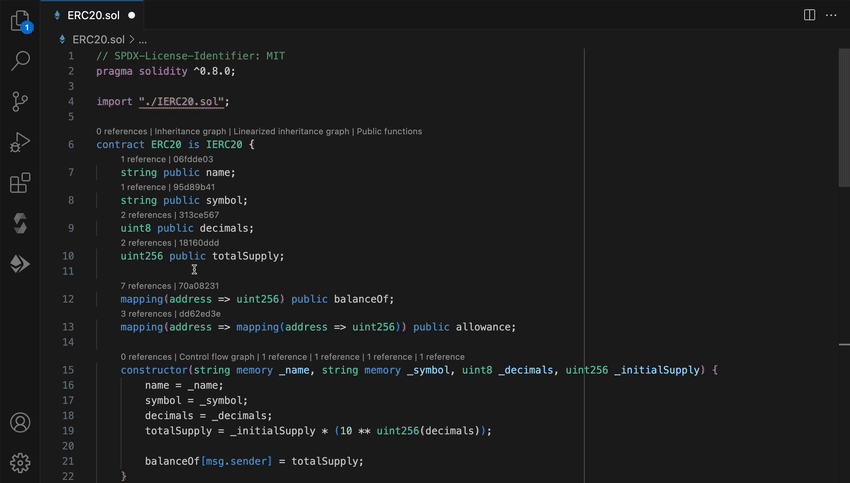
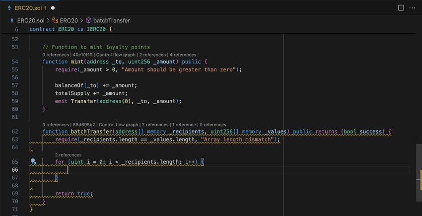
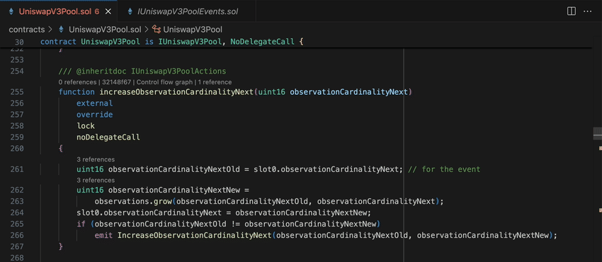
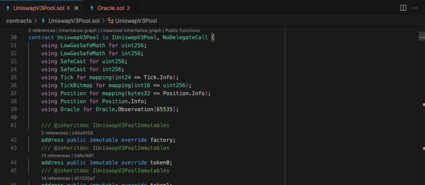

# Solidity by Ackee Blockchain Security

Ethereum Solidity and local node testing with security features for Visual Studio Code.

This extension adds language support for Solidity to Visual Studio Code, and provides a Remix-like experience for testing contracts on your local network.
Benefits:
- [Test and interact with your smart contracts on an Ethereum local node](#test-and-interact-with-your-smart-contracts-on-an-ethereum-local-node)
  - [Compile and deploy contracts](#compile-and-deploy-contracts)
  - [Interact with contracts](#interact-with-contracts)
- [See vulnerabilities from static analysis in real-time](#see-vulnerabilities-from-static-analysis-in-real-time)
  - [Compilation Errors](#compilation-errors)
  - [See vulnerabilities from static analysis in real-time](#see-vulnerabilities-from-static-analysis-in-real-time-1)
  - [Security Overview in the Sidebar](#security-overview-in-the-sidebar)
- [Best code navigation experience, call-graphs and more](#best-code-navigation-experience-call-graphs-and-more)
  - [Go to definition](#go-to-definition)
  - [Find references](#find-references)
  - [Document Links](#document-links)
  - [Hover](#hover)
  - [Contract Outline](#contract-outline)
  - [Code Lens](#code-lens)
  - [Graphs](#graphs)

## Test and interact with your smart contracts on an Ethereum local node

### Compile and deploy contracts

Compile your contracts and deploy them on a local chain for testing

### Interact with contracts

Test your deployed contracts by interacting with them using function calls with different inputs

## See vulnerabilities from static analysis in real-time

### Free detections with leading security tool Wake

Catch potential issues early with real-time static analysis

### Security Overview in the Sidebar

Get an overall overview of issues in your project

### Compilation Errors

See compilation errors highlighted in code

## Best code navigation experience, call-graphs and more

### Go to definition

Quickly navigate to any function or variable definition with a click

### Find references

Right click to see a context menu, and use it to find all references

### Document Links

Click and jump to linked files and resources

### Hover

Use hover to see instant documentation in your code

### Contract Outline

Navigate big projects with ease using the Contract Outline

### Code Lens

Code Lens shows you relevant information like functions selectors and parameter references inside your code

### Graphs

Visualise contract inheritance and function control flows with graphs

## Requirements

The Solidity extension uses the PyPi package [eth-wake](https://pypi.org/project/eth-wake/) which requires Python 3.8 or higher. This package is automatically installed via [conda](https://conda.github.io/conda-pack/) by default.

Rosetta is required to be enabled on Apple Silicon Macs.

## Credits
[juanfranblanco/vscode-solidity](https://github.com/juanfranblanco/vscode-solidity/blob/master/syntaxes/solidity.json): a base of our Solidity grammar

[joaompinto/vscode-graphviz](https://github.com/joaompinto/vscode-graphviz): a base of our Graphviz integration

## Feedback, help and news
Get help and give feedback in our [Discord](https://discord.gg/x7qXXnGCsa)

Follow Ackee on [Twitter](https://twitter.com/AckeeBlockchain)

## Known Issues

- **`Go to references`, number of references and other features do not work correctly with no workspace open**

It is always recommended to open a project as a folder (`File -> Open folder`). `Open file` should only be used when opening a single file or several files inside the same folder.

- **Analysis does not work when the workspace contains compilation errors**

The extension relies on the `solc` compiler. For this reason, files containing compilation errors and files importing these files cannot be analyzed.
